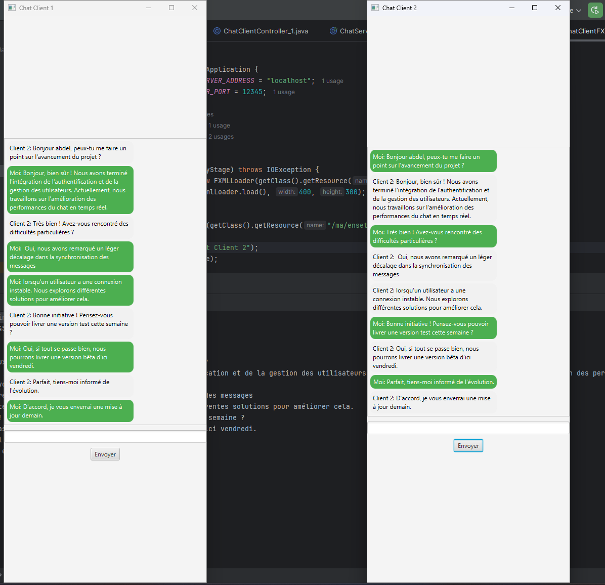
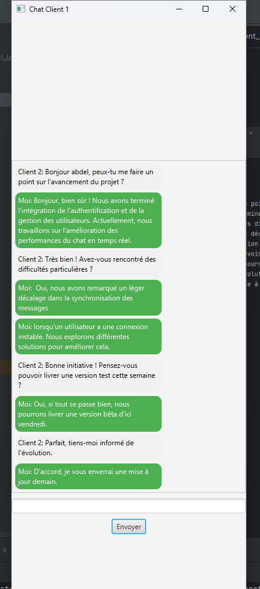
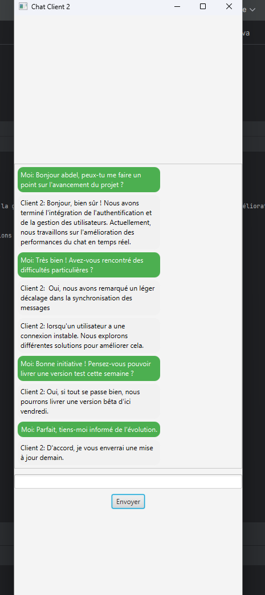
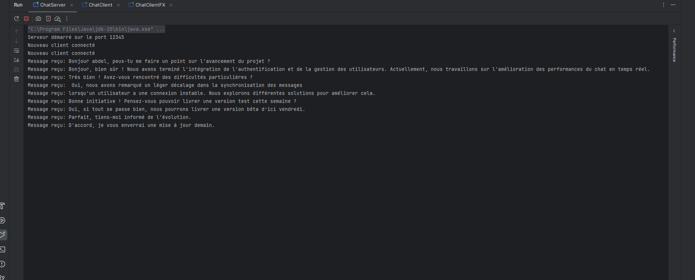

# 🗨️ Application de Chat en JavaFX avec Sockets et Threads

## 📌 Description
✅ Interface utilisateur développée avec **JavaFX**  
✅ Communication en temps réel entre plusieurs clients via **Sockets**  
✅ Utilisation des **Threads** pour la gestion des connexions  
✅ Interface responsive avec du **CSS**  
✅ Différenciation des messages envoyés et reçus  

## 📸 Aperçu de l'application

## 🛠️ Technologies utilisées
- **JavaFX**
- **Sockets TCP**
- **Threads**
- **CSS pour la personnalisation de l'UI**

## 📂 Architecture du projet
📂 src\
┣ 📂 main \
┃ ┣ 📂 java \
┃ ┃ ┗ 📂 ma/enset/app_chat \
┃ ┃ ┣ ChatClient.java\
┃ ┃ ┣ ChatServer.java\
┃ ┃ ┣ ChatClientController.java\
┃ ┣ 📂 resources \
┃ ┃ ┗ 📂 ma/enset/app_chat \
┃ ┃ ┣ chat_client.fxml\
┃ ┃ ┗ styles.css

